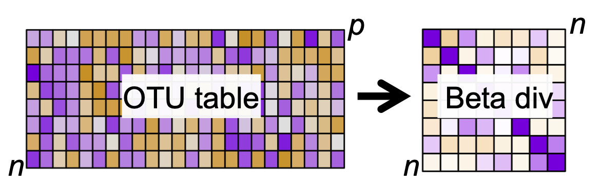
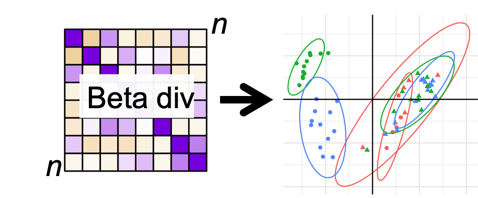

```{r setup, include=FALSE}
knitr::opts_chunk$set(echo = TRUE)
```

Alpha diversity descripes the diversity _within_ a sample. Beta diversity, on the other hand, descriptes the diversity _between_ samples. This implies that beta diversity measures can _not_ be calculated for a single sample, but is calculated for _all pairs_ of samples in the dataset. 

So, if you have 10 samples, then there is $9 + 8 + .... + 1 = 45$ beta diversity measures! 

Each beta diversity measure measures the similarity between the corresponding two samples. That is a distance in _microbiome space_. I.e. is $\beta diversity_{i,j} = 0$ for sample $i$ and $j$ then the two samples are exactly similar. If $\beta diversity_{i,j} >> 0$ is large, then the two samples are very distinct. 

Beta diversity measures are by definition non-negative numbers. 

While this can seem rather complex, combining beta diversity measures with dimentionallity reduction models such as Principal Component Analysis, comprise a very powerful tool for visualizing similarities and sisimilarities between samples. 

# From OTU table to Distance table {-}



Given an OTU table with $n$ samples and $p$ variables (OTUs): $\mathbf{C}$ the first task is to calculate all $n(n-1)/2$ pairwise distances and represent those in a symmetric $n$ by $n$ matrix $\mathbf{D}$. 

There are several different ways to calculate the beta diversity. Check out the distanceMethodList to see those supported by phyloseq. 

These can in general be grouped according to two criterions: 

* Sensitivity towards abundance or presence absense. 

* Incorporation of phylogentic similarity.

A thorough description can be found else where. Here we are going to focus on four common methods, namely __Jaccard__, __Bray Curtis__, __weighted-__ and __unweighted UNIFRAC__, as these methods span the criterions mentioned above. 

Let $a$ and $b$ be count vectors for two samples with equally many features (OTUs) 

## Bray Curtis vs Jaccard {-}

The __Jaccard's index__ solely focus on presence/absence and hence do not distinguis a OTU on its abundance. On the other hand __Bray Curtis__ focuses on abundance. 

## Jaccard {-}

__Jaccard's index__ is defined as follows

$$S_{a,b} = \frac{a>0 \cap b>0}{a>0 \cup b>0} = \frac{\#common OTUs}{\#total OTUs}$$

## Bray Curtis {-}

__Bray Curtis__ dissimilarity index relates to the so-called Manhatten distance, and measures, for each OTU the descripancy in abundance. Normalized, and summed 

$$BC_{a,b} = \frac{\sum |a_i - b_i |}{\sum (a_i + b_i)} $$ for $i = 1,...,p$

Two observations: 

For OTU's _absent_ in both samples $|a_i - b_i | = 0$ which implies that BC only depends on observed OTUs. 
BC is insensitive towards total sum normalizion, as this is an inherent part of the denominator. 


## UNIFRAC {-}

Both, Jaccard and Bray Curtis makes a _flat_ comparison of the samples, meaning, that any two different OTUs are alike. This, however we know is not the case, as OTUs belonging to the same taxonomic group (say Family) are _more_ similar than two belonging to different groups. Utilizing this actively in the computation of similarities have some advances, as it removes uncertainty due to somewhat wrong annotation, reduces emphasis on differences between phylogenetic similar OTUs and enhances differences due to diffences on a diverse phylogenetic level. 

In line with Jaccard / Bray Curtis, Unifrac can be computed focusing on presence/absence as well as abundance. These are called unweigted and weighted unifrac respectively. 

# From Distance table to PCoA plot {-}



Beta diversity measures has a similar structure as correlation / covariance matrices. Such matrices can be projected into a low dimensionality representation which can be visualized, showing the _largest common variation_ from complex data in a simple plot. These plots are often refered to as ordination plots. For theory on such dimensionality reduction look up Principal Component Analysis (PCA), eigenvalue/eigenvector decomposition and multidimensional scaling. 

The function ordinate() and plot_ordination() from phyloseq are very useful for beta diversity plotting of microbiome data. 

```{r}
library(phyloseq)
library(ggplot2)
load('./data/Rats_inulin.RData')
ordBC <- ordinate(phyX, "PCoA", "bray")
plot_ordination(phyX,ordBC, color = 'Description') + 
  stat_ellipse() + 
  facet_wrap(~time) + 
  theme(legend.position = 'bottom')
```

The plot_ordination() is in synch with ggplot2, why ggplot2 functionality adapts nicely. 

The interpretation of ordination plots are simple: Two points in close proximity are alike, while those distant are not alike. 

# Exercise

## Four different diversity measures

Compute all four diversity measures directly on the _Rat_ dataset. You might want to include some preprocessing.

```{r, eval = F}
library(phyloseq)
load('./data/Rats_inulin.RData'); 

ordBC <- ordinate(phyX, "PCoA", "bray")
ordJC <- ordinate(phyX, "PCoA", "jaccard")
ordUF <- ordinate(phyX, "PCoA", "unifrac")
ordwUF <- ordinate(phyX, "PCoA", "wunifrac")

smpID <- sample_data(phyX)$X.SampleID

df <- rbind(data.frame(ordBC$vectors[,1:4],X.SampleID = smpID, method = 'BC'),
            data.frame(ordJC$vectors[,1:4],X.SampleID = smpID,method = 'Jaccard'),
            data.frame(ordUF$vectors[,1:4],X.SampleID = smpID,method = 'unifrac'),
            data.frame(ordwUF$vectors[,1:4],X.SampleID = smpID,method = 'wunifrac'))

# add sample_data info
df <- merge(df, data.frame(sample_data(phyX)), by = 'X.SampleID')


g1 <- ggplot(data = df, aes(Axis.1,Axis.2, 
                      color = factor(Description),
                      shape = time, 
                      group = factor(Description):factor(time))) + 
  geom_point() + 
  stat_ellipse() + 
  facet_wrap(~method,scales = 'free')

pdf('./figs/PCoA.pdf', width = 8, height = 6)
g1 +geom_hline(yintercept = 0) + geom_vline(xintercept = 0)  + theme_minimal()
dev.off()
```


## Sensitive towards normalization

Based on the formulation, which of the methods are sensitive towards total sum normalization?

```{r, eval = F, include=F}
NONE
```

## Compare methods

Compare the different similarity methods by vectorizing and correlating the distance objects. 

```{r,eval = F}
D_BC <- phyloseq::distance(phyX, "bray")
D_JC <- phyloseq::distance(phyX, "jaccard")
D_UF <- phyloseq::distance(phyX,  "unifrac")
D_wUF <- phyloseq::distance(phyX, "wunifrac")
dist_df <- data.frame(bray = as.vector(D_BC), 
           jaccard = as.vector(D_JC), 
           unifrac = as.vector(D_UF), 
           wunifrac = as.vector(D_wUF))

cor(dist_df)
```

## Plot it!! with design

The experiment is longitudinal with before and after diet (sausage) intervention. Try to infer this on the PCoA plot. 

```{r,eval = F}
ggplot(data = df, aes(Axis.1,Axis.2, 
                      color = factor(Description),
                      shape = time, 
                      group = ID)) + 
  geom_point() +
  geom_line() + 
  stat_ellipse(aes(group = factor(Description):factor(time))) + 
  facet_wrap(~method,scales = 'free')

```

## Within subject variation

Are there any tendencies towards each rat being more similar with it self over time? 

## Cowboy linear models

Try to compute a normal linear anova model with the component axis (1,2,..) as response dependent on time and rat ID. 

```{r, eval=F}
mdl <- lm(data = df[df$method=='Jaccard',],Axis.1~ID + time*Description)
anova(mdl)
```


### The tidyverse way

There is a new R-modelling paragdigme making it easy to do many things at once. 
If you find the coding trivial, it might be worth looking into, as it - after some headache - makes life easier. However, it is not a microbiome-thing, only R, and you can achieve the same with the more basic commands. 
Below is shown how the linear models from the chunk above is computed for all methods using the tidyverse and broom packages. 

```{r, eval=F}
library(tidyverse)
library(broom)
df %>% 
  group_by(method) %>% 
  do(lm(data = ., Axis.1~ID + time*Description) %>% anova %>% tidy)
```


This is kinda add hoc, as the composition is captured in not-only a single component. I.e. instead of using Axis.1 we would like to use all the Axes,... or the entire distance matrix. This is exactly the purpose of permanova. See more under __Statistical inference__ -> __ANOVA on beta diversity__.  


# References {-}

[Chen, Jun, Kyle Bittinger, Emily S. Charlson, Christian Hoffmann, James Lewis, Gary D. Wu, Ronald G. Collman, Frederic D. Bushman, and Hongzhe Li. __Associating microbiome composition with environmental covariates using generalized UniFrac distances__. Bioinformatics 28, no. 16 (2012): 2106-2113.](https://www.ncbi.nlm.nih.gov/pmc/articles/PMC3413390/)

[Schmidt, Thomas Sebastian Benedikt, João Frederico Matias Rodrigues, and Christian Von Mering. __A family of interaction-adjusted indices of community similarity__ The ISME journal 11, no. 3 (2017): 791.](https://www.nature.com/articles/ismej2016139)

[Lozupone, Catherine, and Rob Knight. __UniFrac: a new phylogenetic method for comparing microbial communities__. Appl. Environ. Microbiol. 71, no. 12 (2005): 8228-8235.](https://aem.asm.org/content/aem/71/12/8228.full.pdf)

Xia, Yinglin, Jun Sun, and Ding-Geng Chen. __Statistical analysis of microbiome data with R__. Springer, 2018. Chapter 6. 
